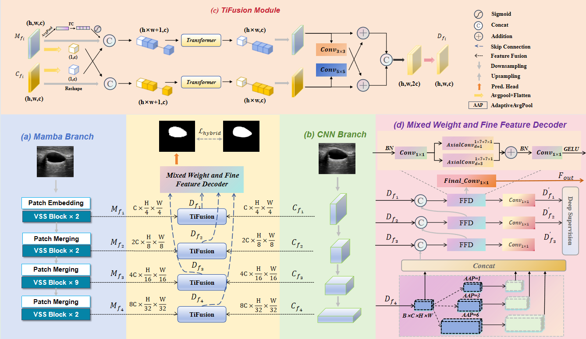

# BC-Mamba: Boundary-Aware Contextual CNNs-Mamba for Accurate Ultrasound Image Segmentation

Official repository for: *[BC-Mamba: Boundary-Aware Contextual CNNs-Mamba for Accurate Ultrasound Image Segmentation](https://github.com/ScholarChen20/HCMNet)*



The source code will be released to the public in the near future.

If you have any questions, please contact: chen_wenqin2002@163.com

## Main Results

- BUSI
- STU
- DDTI
- SZU-BCH-TUS983

## Installation

**Step-1:** Create a new conda environment & install requirements

```shell
conda create -n bc_mamba python=3.10
conda activate bc_mamba

pip install torch==2.0.1 torchvision==0.15.2
pip install causal-conv1d==1.1.1
pip install mamba-ssm
pip install torchinfo timm numba
```

**ImageNet pretrained model:** 

We use the ImageNet pretrained VMamba-Tiny model from [VMamba](https://github.com/MzeroMiko/VMamba). You need to download the model checkpoint and put it into `pretrained_ckpt/vmamba_tiny_e292.pth`
We use the ImageNet pretrained ConvNeXt-T model from [VMamba](https://github.com/facebookresearch/ConvNeXt). You need to download the model checkpoint and put it into `pretrained_ckpt/convnext_tiny_1k_224_ema.pth`

```
wget https://github.com/MzeroMiko/VMamba/releases/download/%2320240218/vssmtiny_dp01_ckpt_epoch_292.pth
mv vssmtiny_dp01_ckpt_epoch_292.pth data/pretrained/vmamba/vmamba_tiny_e292.pth
```


## Acknowledgements

We thank the authors of [nnU-Net](https://github.com/MIC-DKFZ/nnUNet), [Mamba](https://github.com/state-spaces/mamba), [VMamba](https://github.com/MzeroMiko/VMamba), [Swin-UMamba](https://github.com/JiarunLiu/Swin-UMamba) and [Swin-Unet](https://github.com/HuCaoFighting/Swin-Unet) for making their valuable code & data publicly available.


## Citation

```

```


